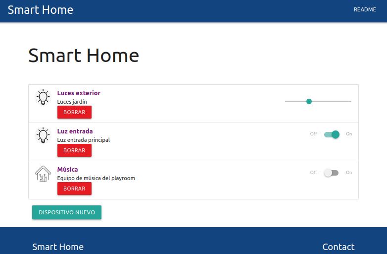
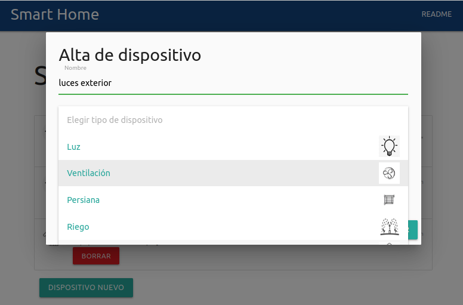

<a href="https://www.gotoiot.com/">
    
</a>

Aplicación Web Smart Homes
==========================

Este proyecto es una aplicación Web Fullstack que se ejecuta sobre el ecosistema `Docker`. Está compuesta por un compilador de `TypeScript` que permite utilizar este superset de JavaScript para poder programar un `cliente web`. También tiene un servicio en `NodeJS` que permite ejecutar código en backend y al mismo tiempo disponibilizar el código del cliente web para interactar con el servicio. Además tiene una `base de datos` MySQL que puede interactuar con el backend para guardar y consultar datos, y de manera adicional trae un `administrador` de base de datos para poder administrar o consultar la base desde un explorador.

El proyecto consiste en una aplicación IoT que permite, desde un navegador, controlar el estado de los devices de un hogar inteligente - *como pueden ser luces, TVs, ventiladores, persianas, enchufes y otros* -.
Desde la aplicación se puede controlar el estado de los mismos que, dependiendo de cada dispositivo, puede ser un estado On/Off, o puede ser un valor gradual de 0 a 100%. Este valor corresponde por ejemplo a la intensidad de una luz, o el grado de apertura de un portón.
Además de controlar el estado, la página permite crear nuevos dispositivos o dar de baja los existentes.

En esta imagen se puede ver una captura de pantalla del cliente web que controla los artefactos del hogar.




## Comenzando 🚀

Esta sección es una guía para poner en marcha la aplicación.
<details><summary><b>Ver los pasos necesarios</b></summary><br>

### Instalar las dependencias

Para correr este proyecto es necesario tener instalado `Docker` y `Docker Compose`.

En [este artículo](https://www.gotoiot.com/pages/articles/docker_installation_linux/) publicado en la web de la cátedra están los detalles para instalar Docker y Docker Compose en una máquina Linux.
Para instalar las herramientas en otra plataforma o en caso de tener algún inconveniente, se puede recurrir a la documentación oficial de [Docker](https://docs.docker.com/get-docker/) y también la de [Docker Compose](https://docs.docker.com/compose/install/).

### Descargar el código

Este proyecto se creó a partir de un fork de [este link](https://github.com/gotoiot/app-fullstack-base/fork).
Para correr esta implementación en particular, el código se puede clonar directamente con:

```
git clone https://github.com/maricari/app-fullstack-base.git
```

### Ejecutar la aplicación

La aplicación se ejecuta mediante el comando `docker-compose up` desde la raíz del proyecto. Este comando va a descargar las imágenes de Docker de Node, Typescript y MySQL (base de datos y PHP myAdmin), y luego las levantará como containers de Docker.

Para acceder al cliente web se debe ingresar a [http://localhost:8000/](http://localhost:8000/) y para acceder al admin de la DB, a [localhost:8001/](http://localhost:8001/).

</details>

## Configuraciones de funcionamiento 🔩

Como se mencionó, la aplicación corre en contenedores de Docker. A continuación hay alguna información útil para el caso que se quieran hacer agregados a la aplicación o modificaciones a la base de datos o a las configuraciones de acceso.

<details><summary><b>Ver cómo configurar la aplicación</b></summary><br>

### Configuración de la DB

Para acceder a PHPMyAdmin hay que ingresar en la URL [localhost:8001/](http://localhost:8001/). En el login del administrador, el usuario para acceder a la db es `root` y contraseña es la variable `MYSQL_ROOT_PASSWORD` del archivo `docker-compose.yml`.

Para el caso del servicio de NodeJS que se comunica con la DB, los datos de acceso para ingresar a la base están en el archivo `src/backend/mysql-connector.js`.

Para cambiar la contraseña, puertos, hostname u otras configuraciones de la DB habría que modificar primero el servicio de la DB en el archivo `docker-compose.yml` y luego actualizar las configuraciones para acceder desde PHPMyAdmin y el servicio de NodeJS.

### Estructura de la DB

Al iniciar el servicio de la base de datos por primera vez, la base de datos se crea automáticamente mediante la ejecución del script `db/dumps/smart_home.sql`.

Los dispositivos de la aplicación se almacenan en una tabla de la base de datos llamada `Devices`, que ya viene precargada con algunos dispositivos de ejemplo. En el caso de querer agregar o modificar dispositivos de la lista inicial, o modificar la estructura de la tabla serán necesario dos pasos:
- modificar el script `db/dumps/smart_home.sql`.
- crear nuevamente la base de datos para que se tomen en cuenta los cambios. Para esto borrar el directorio de datos con el comando `sudo rm -r db/data` y reiniciar la aplicación.

Nota: se debe usar `sudo` ya que la base de datos se crea con permisos de superusuario.

</details>


## Detalles principales 🔍

En esta sección se explican las características más relevantes del proyecto.

<details><summary><b>Ver los detalles más importantes </b></summary><br>
<br>

### Arquitectura de la aplicación

Como se dijo, la aplicación se ejecuta sobre el ecosistema Docker. La siguiente figura muestra el diagrama de arquitectura.


### El cliente web

El cliente web es una Single Page Application que se comunica con el servicio en NodeJS mediante JSON a través de requests HTTP. Puede consultar el estado de dispositivos en la base de datos (por medio del servicio en NodeJS) y también cambiar el estado de los mismos. Los estilos del código están basados en **Material Design**.

### El servicio web

El servicio en **NodeJS** posee distintos endpoints para comunicarse con el cliente web mediante requests HTTP enviando **JSON** en cada transacción. Procesando estos requests es capaz de comunicarse con la base de datos para consultar y controlar el estado de los dispositivos, y devolverle una respuesta al cliente web también en formato JSON. Asimismo el servicio es capaz de servir el código del cliente web.

### La base de datos

La base de datos se comunica con el servicio de NodeJS y permite almacenar el estado de los dispositivos en la tabla **Devices**. Ejecuta un motor **MySQL versión 5.7** y permite que la comunicación con sus clientes pueda realizarse usando usuario y contraseña en texto plano. En versiones posteriores es necesario brindar claves de acceso, por este motivo la versión 5.7 es bastante utilizada para fases de desarrollo.

### El administrador de la DB

Para esta aplicación se usa el administradod de base de datos **PHPMyAdmin**. Este servidor está disponible en caso de querer realizar operaciones con la base, como crear tablas, modificar columnas, hacer consultas y otras cosas más.

### El compilador de TypeScript

**TypeScript** es un lenguaje de programación libre y de código abierto desarrollado y mantenido por Microsoft. Es un superconjunto de JavaScript, que esencialmente añade tipos estáticos y objetos basados en clases. Para esta aplicación se usa un compilador de TypeScript basado en una imagen de [Harmish](https://hub.docker.com/r/harmish) en Dockerhub. El compilador está configurado para monitorear en tiempo real los cambios que se realizan sobre el directorio **src/frontend/ts** y automáticamente generar código compilado a JavaScript en el directorio  **src/frontend/js**. Los mensajes del compilador aparecen automáticamente en la terminal al ejecutar el comando **docker-compose up**.

### Ejecución de servicios

Los servicios de la aplicación se ejecutan sobre **contenedores de Docker**, así se pueden desplegar de igual manera en diferentes plataformas. Los detalles sobre cómo funcionan los servicios se encuentran en el archivo **docker-compose.yml**.

### Organización del proyecto

A continuación se ve cómo está organizado el proyecto:

```sh
├── db                          # directorio de la DB
│   ├── data                    # estructura y datos de la DB
│   └── dumps                   # directorio de estructuras de la DB
│       └── smart_home.sql      # estructura con la base de datos "smart_home"
├── doc                         # documentación general del proyecto
└── src                         # directorio código fuente
│   ├── backend                 # directorio para el backend de la aplicación
│   │   ├── index.js            # código principal del backend
│   │   ├── mysql-connector.js  # código de conexión a la base de datos
│   │   ├── package.json        # configuración de proyecto NodeJS
│   │   └── package-lock.json   # configuración de proyecto NodeJS
│   └── frontend                # directorio para el frontend de la aplicación
│       ├── js                  # codigo javascript que se compila automáticamente
│       ├── static              # archivos de estilos, imágenes, fuentes, etc.
│       ├── ts                  # código TypeScript
│       └── index.html          # archivo principal del cliente HTML
├── docker-compose.yml          # archivo donde se aloja la configuración completa
├── README.md                   # este archivo
├── CHANGELOG.md                # archivo para guardar los cambios del proyecto
├── LICENSE.md                  # licencia del proyecto
```

</details>

## Detalles de implementación 💻

En esta sección se describen los detalles específicos de funcionamiento del código.

<details><summary><b>Ver los detalles de implementación</b></summary><br>

### Agregar un dispositivo

Para agregar un dispositivo desde el cliente web se deberá presionar el botón DISPOSITIVO NUEVO, e ingresar los datos:
- nombre
- tipo de dispositivo: Los tipos disponibles son Luz, Ventilación, Persiana, Riego, Otro.
- Tipo de estado: On/Off (si es un dispositivo que únicamente se controla con un interruptor), o Intensidad (si el valor se puede graduar - por ejemplo dimerizar las luces o regular la apertura de cortinas -

### Dar de baja un dispositivo

Cualquiera de los dispositivos puede darse de baja apretando el correspondiente botón BORRAR.

### Modificar el estado de un dispositivo

Desde el cliente web se puede modificar el estado de cualquiera de los dispositivos. En el caso de ser uno de tipo On/Off, bastará con presionar el switch correspondiente. En el caso de los dispositivos regulables, el estado se actualiza mediante el slicer. Por ejemplo  para una cortina el marcador colocado en el medio indicará que la misma debe estar a mitad del recorrido. En el caso de una lámpara significa que la misma está dimerizada al 50%.

### Frontend

La página consiste en un listado de los dispositivos disponibles con la posibilidad de dar de alta nuevos dispositivos, y dar de baja o modificar el estado de los existentes.

**Carga de la página**

Cada vez que se agrega o se borra un dispositivo, la página  se recarga para poder ver siempre toda la información actualizada.
Para armar el listado de dispositivos que se muestran se ejecuta el request `devices` que devuelve la lista completa.

Los tipos de dispositivo están predefinidos: Luz, ventilación, etc. Internamente cada tipo de dispositivo tiene un código, por ejemplo `1`. Los íconos que se muestran en la interfaz se toman de una carpeta de imágenes donde los nombres de las imágenes se corresponden con el tipo, por ejemplo `1.jpg` corresponde al tipo de dispositivo con código `1` que en este caso es Luz.

**Cambio de estado de dispositivos**

Para cambiar el estado de un dispositivo, el usuario hace click en el interruptor o desliza el marcador del slicer según corresponda. Para actualizar el estado el front determina cuál es el tipo de dispositivo (para saber si debe actualizar el estado o la intensidad) y luego ejecuta el request `devicesChange`. 

**Alta de dispositivos**

Para dar de alta un dispositivo, el usuario debe completar un formulario modal el cual le permite ingresar el nombre y la descripción, y elegir el tipo de dispositivo y el tipo de estado a partir de una lista desplegable. Estas listas son fijas (es decir, no es posible agregar un tipo de dispositivo nuevo desde la interfaz de usuario). En caso de no encontrar el valor requerido, se puede indicar `Otro`. Con todos estos datos, la confirmación del usuario dispara la ejecución del request `devicesNew`.



**Baja de dispositivos**

Para dar de baja, se obtiene el `id` del dispositivo seleccionado y se ejecuta el request `devicesDelete`.


### Backend

Se explican aquí todos los detalles de funcionamiento sobre el backend, sus interacciones con el cliente web y la base de datos.

<details><summary><b>Ver detalles de la base de datos</b></summary><br>

La base de datos tiene una única tabla llamada `Devices` con las siguientes columnas:
-  `id`: identificador único (autonumérico)
- `type`: Código correspondiente al tipo de dispositivo: luces, ventilación, etc.
- `name`: Nombre del dispositivo
- `description`: Descripción
- `state_type`: Tipo de estado. 1: On/off, 2: Intensidad
- `state`: Estado. Es un valor booleano. `Falso`: dispositivo apagado, `Verdadero`: dispositivo encendido.
- `intensidad`: Valor de la intensidad de `0` a `100`. (únicamente para los dispositivos de tipo 2)

La tabla `Devices` ya viene precargada con algunos dispositivos de ejemplo.

</details>

<details><summary><b>Ver los endpoints disponibles</b></summary><br>

El backend soporta los siguientes endpoints:

1) Devolver la lista de dispositivos.
* Método: GET
* Entrypoint: /devices
* Parámetros: Ninguno
* Respuesta: Lista de dispositivos
* Ejemplo de respuesta:

```
...
status: 200
responseText:
   [{"id":1,
     "type":1,
     "name":"Luces exterior",
     "description":"Luces jardín",
     "state_type":2,
     "state":1,
     "intensidad":97},
    {"id":1,
     "type":1,
     "name":"Luz entrada",
     "description":"Luz entrada principal",
     "state_type":1,
     "state":1,
     "intensidad":0},
     ...
     ]
```

2) Alta de dispositivo.
* Método: POST
* Entrypoint: /devicesNew
* Request_headers: application/json
* Ejemplo de body:

```
 { type: '4',
   name: 'TV',
   description: 'TV playroom',
   state_type: ''
   }
```

3) Modificación de estado.
* Método: PUT
* Entrypoint: /devicesChange
* Request_headers: application/json
* Ejemplo de body:

```
{ id: '7',
  status: true,
  intensidad: 0 }

```

4) Baja de dispositivo.
* Método: DELETE
* Entrypoint: /devicesDelete
* Request_headers: application/json
* Ejemplo de body:

```
 { id: '10' }
```

</details>

<details><summary><b>Ver algunas propuestas de mejora</b></summary><br>

* Implementar nuevos tipos de dispositivo. Se puede hacer `hardcoded` como los que están ahora, o se puede adaptar la aplicación para que permita también mantener una tabla de tipos de dispositivos en la base de datos, que se levante en forma dinámica desde la aplicación.
* Validar los datos ingresados por el usuario. Actualmente no se hacen validaciones, y solamente las operaciones son rechazadas desde el motor de base de datos en caso de no cumplir con las restricciones (por ejemplo valor no nulo).
* Permitir la modificación de atributos de los dispositivos. Desde el frontend sería una funcionalidad nueva. Desde el backend, implicaría modificar el endpoint `devicesChange` para admitir más/otras columnas.
</details>

</details>


## Tecnologías utilizadas 🛠️

A continuación se listan las tecnologías más importantes utilizadas en el proyecto.

<details><summary><b>Ver la lista completa de tecnologías</b></summary><br>

* [Docker](https://www.docker.com/) - Ecosistema que permite la ejecución de contenedores de software.
* [Docker Compose](https://docs.docker.com/compose/) - Herramienta que permite administrar múltiples contenedores de Docker.
* [Node JS](https://nodejs.org/es/) - Motor de ejecución de código JavaScript en backend.
* [MySQL](https://www.mysql.com/) - Base de datos para consultar y almacenar datos.
* [PHPMyAdmin](https://www.phpmyadmin.net/) - Administrador web de base de datos.
* [Material Design](https://material.io/design) - Bibliotecas de estilo responsive para aplicaciones web.
* [TypeScript](https://www.typescriptlang.org/) - Superset de JavaScript tipado y con clases.

</details>

## Contribuir 🖇️

Si estás interesado en el proyecto y te gustaría sumar fuerzas para que siga creciendo y mejorando, podés abrir un hilo de discusión para charlar tus propuestas en [este link](https://github.com/gotoiot/app-fullstack-base/issues/new). Así mismo podés leer el archivo [Contribuir.md](https://github.com/gotoiot/gotoiot-doc/wiki/Contribuir) de nuestra Wiki donde están bien explicados los pasos para que puedas enviarnos pull requests.

## Sobre Goto IoT 📖

Goto IoT es una plataforma que publica material y proyectos de código abierto bien documentados junto a una comunidad libre que colabora y promueve el conocimiento sobre IoT entre sus miembros. Acá podés ver los links más importantes:

* **[Sitio web](https://www.gotoiot.com/):** Donde se publican los artículos y proyectos sobre IoT. 
* **[Github de Goto IoT:](https://github.com/gotoiot)** Donde están alojados los proyectos para descargar y utilizar. 
* **[Comunidad de Goto IoT:](https://groups.google.com/g/gotoiot)** Donde los miembros de la comunidad intercambian información e ideas, realizan consultas, solucionan problemas y comparten novedades.
* **[Twitter de Goto IoT:](https://twitter.com/gotoiot)** Donde se publican las novedades del sitio y temas relacionados con IoT.
* **[Wiki de Goto IoT:](https://github.com/gotoiot/doc/wiki)** Donde hay información de desarrollo complementaria para ampliar el contexto.

## Muestras de agradecimiento 🎁

Si te gustó este proyecto y quisieras apoyarlo, cualquiera de estas acciones estaría más que bien para nosotros:

* Apoyar este proyecto con una ⭐ en Github para llegar a más personas.
* Sumarte a [nuestra comunidad](https://groups.google.com/g/gotoiot) abierta y dejar un feedback sobre qué te pareció el proyecto.
* [Seguirnos en twitter](https://github.com/gotoiot/doc/wiki) y dejar algún comentario o like.
* Compartir este proyecto con otras personas.

## Autores 👥

Las colaboraciones principales fueron realizadas por:

* **[Agustin Bassi](https://github.com/agustinBassi)**: Ideación, puesta en marcha y mantenimiento del proyecto.
* **[Ernesto Giggliotti](https://github.com/ernesto-g)**: Creación inicial del frontend, elección de Material Design.
* **[Brian Ducca](https://github.com/brianducca)**: Ayuda para conectar el backend a la base de datos, puesta a punto de imagen de Docker.

También podés mirar todas las personas que han participado en la [lista completa de contribuyentes](https://github.com/###/contributors).

## Licencia 📄

Este proyecto está bajo Licencia ([MIT](https://choosealicense.com/licenses/mit/)). Podés ver el archivo [LICENSE.md](LICENSE.md) para más detalles sobre el uso de este material.

---

**Copyright © Goto IoT 2021** ⌨️ [**Website**](https://www.gotoiot.com) ⌨️ [**Group**](https://groups.google.com/g/gotoiot) ⌨️ [**Github**](https://www.github.com/gotoiot) ⌨️ [**Twitter**](https://www.twitter.com/gotoiot) ⌨️ [**Wiki**](https://github.com/gotoiot/doc/wiki)
